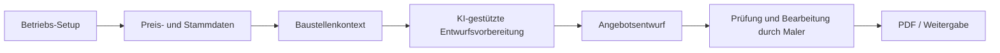

# Architektur · FotoKalk

Die öffentliche Architektur beschreibt die Komponenten auf Produkt- und Systemebene. Sie veröffentlicht keine API-Routen, Auth-Logik, Zahlungslogik oder Datenbankdetails.

## Komponenten

| Bereich | Aufgabe | Öffentlicher Detailgrad |
| --- | --- | --- |
| Betriebs-Setup | Betrieb, Logo, Kontaktdaten, PDF-Darstellung, Grundlogik | Kategorien nennen, keine echten Daten |
| Preislogik | Preislisten, Stundenlohn, Standardpositionen, Material-/Leistungslogik | Konzept nennen, keine produktiven Preislisten |
| Baustellenkontext | Fotos, Notizen, Text, PDF, Sprache, Raumdaten | Inputs nennen, keine Upload-/API-Details |
| KI-Schritt | Kontext strukturieren und Angebotsentwurf vorbereiten | Ergebnisrolle beschreiben, keine Prompts |
| Angebotsentwurf | Positionen, Beschreibung, Preisstruktur, PDF-Ausgabe | Demo-/Beispielstruktur statt echte Angebote |
| Prüfung | Fachliche Kontrolle durch Nutzer | zentraler öffentlicher Punkt |

## Was detailgetreu bleibt

- FotoKalk war nicht nur Landingpage, sondern App-Oberfläche mit Dashboard-/Angebots-/Kunden-/Einstellungsbereichen.
- Preislisten, Stundenlogik, PDF-Ausgabe und Angebotspositionen waren echte Produktbereiche.
- Foto-/Text-/Dokumentkontext und Raumdaten wurden als Eingaben in der Angebotserstellung gedacht.
- Web- und native Verpackung wurden durch Next.js und Capacitor vorbereitet.

## Was redigiert bleibt

- konkrete API-Endpunkte
- Auth-/Team-/Billing-/Admin-Implementierung
- Datenbanktabellen und Migrationen
- echte Konfiguration
- produktive Kundendaten
