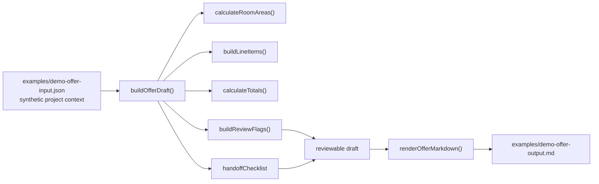

# Architecture · FotoKalk

This repository shows a reduced, public-safe technical excerpt of the FotoKalk product logic. It keeps the workflow that an employer can inspect locally: room context, pricing positions, totals, review flags and handoff output.

It does not contain the full private product repository. The actual FotoKalk product surface is linked from the README.

## Product shape

FotoKalk is framed as a web app for painting businesses. The relevant product flow is:

1. A painter configures business context: company data, brand voice, logo context, price list and hourly rate.
2. A site visit creates working material: photos, notes, room dimensions and practical constraints.
3. The app turns that material into a structured offer draft.
4. Review flags make clear what the painter must check before anything becomes a real offer.

## Runnable code excerpt

## Runtime surfaces

| Surface | Purpose |
| --- | --- |
| `src/offer-flow.mjs` | Core workflow: calculations, line items, review flags, markdown rendering |
| `test/offer-flow.test.mjs` | Tests for room areas, price logic, review flags and handoff output |
| `scripts/demo.mjs` | CLI demo for markdown, JSON, summary and generated example output |
| `examples/demo-offer-input.json` | Synthetic input using Max Mustermann data |

## What is intentionally represented from the private app

- room and opening calculations
- business profile, brand voice and price basis as input concepts
- pricing positions for wall, ceiling, preparation, masking and disposal
- structured offer output
- review flags for measurements, photos, demo prices and blockers
- handoff checklist before anything could be sent to a customer

## What is intentionally not represented from the private app

- production API routes
- authentication, teams, billing, payment or admin code
- production database schema
- external AI routing details
- private prompts, customer transcripts, logs or internal notes
- real customer records, quotes, invoices or contact details

## Review principle

The important product decision is not that AI sends an offer by itself. The important decision is that the app prepares a structured draft and keeps the final technical and commercial decision with the painter.
