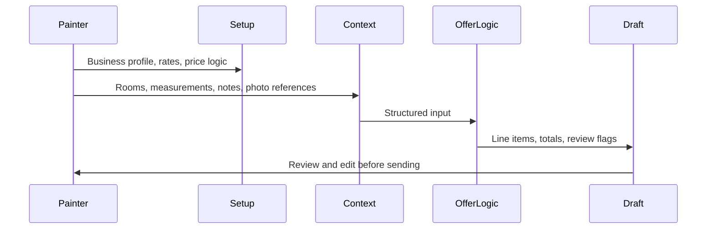
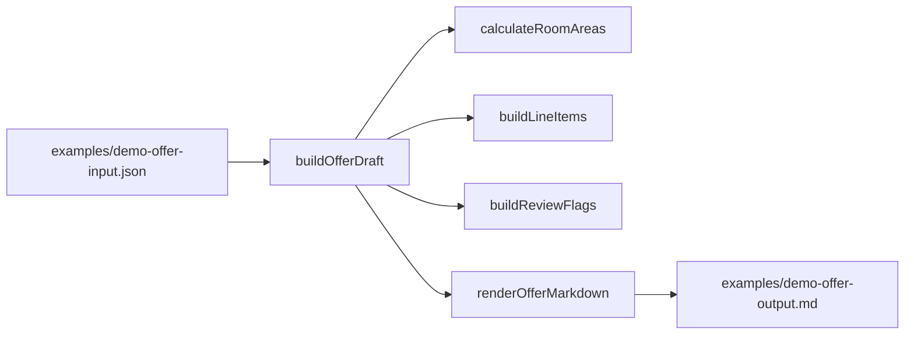

# Workflow · FotoKalk

## User flow

1. Open the app and configure the business profile.
2. Add brand voice, logo context, company data, price logic and hourly rates.
3. Start a new offer draft.
4. Add room measurements, site notes and demo photo references.
5. Generate structured line items and totals.
6. Review measurement, pricing and context flags.
7. Edit the draft before using it as a real offer.

## Code flow in this repo

## Main product decision

The app should not pretend that a photo alone is enough for a reliable offer. The public-safe workflow keeps this distinction visible:

- photos and notes create context
- room data drives calculations
- price logic creates draft positions
- review flags show what still needs human checking
- the final decision stays with the painter
