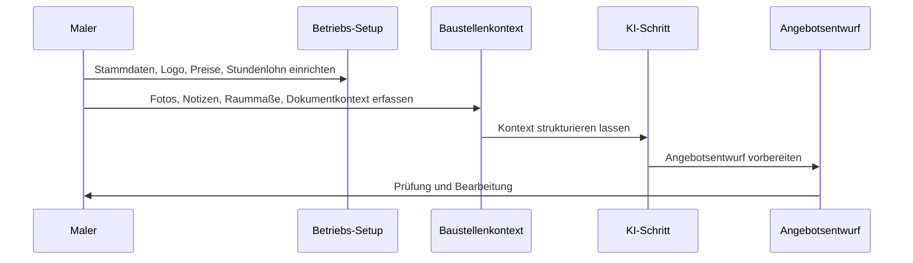

# Workflow · FotoKalk

## Nutzerablauf

1. App öffnen und Betrieb einrichten.
2. Brand Voice, Logo, Stammdaten, PDF-Darstellung, Preislisten und Stundenlöhne hinterlegen.
3. Neues Angebot starten.
4. Baustellenfotos, Notizen, Text/PDF-Kontext und Raummaße erfassen.
5. KI bereitet den Kontext und einen Angebotsentwurf vor.
6. Maler prüft Positionen, Raummaße, Preise und Formulierungen.
7. Entwurf wird bearbeitet und als Angebot/PDF weiterverwendet.

## Produktentscheidung

Der erste sinnvolle Umfang ist nicht “KI macht alles”, sondern:

- Eingaben sauber sammeln
- Betriebslogik berücksichtigen
- Entwurf vorbereiten
- fachliche Kontrolle sichtbar halten

## Arbeitgeber-Signal

FotoKalk zeigt, dass Robert ein reales Arbeitsproblem in einen App-Flow übersetzen kann: Setup, Daten, KI-Schritt, Ausgabe und menschliche Prüfung.

